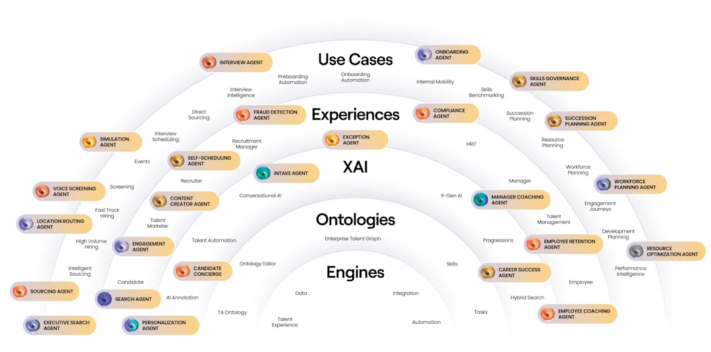

# AI Policy Rule Engine

Turns messy policy PDFs (HR manuals, compliance docs, contracts) into structured, queryable business rules — with every answer traced back to the exact page and paragraph it came from.

    

**[Live Demo](https://ai-policy-rule-engine.vercel.app)** · [Architecture](#how-it-works) · [Run Locally](#run-locally)



## The problem

Compliance and HR teams sit on hundreds of pages of policy documents. Answering "can an employee expense a business dinner?" means someone manually re-reading a PDF. This engine reads it once, extracts every rule as structured data, and answers questions in seconds — citing the exact sentence and page it used.

## How it works

A 6-stage pipeline turns raw PDF text into grounded, structured knowledge:

`Parse → Chunk → Detect → Classify → Extract → Validate` → dual-indexed in **Pinecone** (vector search) + **SQL** (structured queries).

Queries then run through a **dual-tier RAG reasoner**: try answering from structured rules first, fall back to raw document chunks if the rules don't cover it, and only then admit "not found" — instead of guessing.

## Why it's more than a wrapper around an LLM API

- **Self-validating extraction** — every extracted rule gets a confidence score; anything under 85% is discarded before it ever reaches the database, not surfaced to the user as a guess.
- **Dual-provider LLM fallback** — primary calls go to Groq/Grok; on failure (rate limit, timeout, bad key) the pipeline transparently retries on Gemini, so a single provider outage doesn't take down the product.
- **Grounded citations, not just text** — each rule retains its page number and bounding box, so the UI can highlight the *exact* source sentence in the original PDF next to the answer.
- **Multilingual retrieval** — non-English queries are detected, translated for retrieval/reasoning (so vector search quality doesn't degrade), then translated back for the user.
- **Redis-backed caching** for both query results and embeddings, keeping repeat queries fast without re-hitting the LLM or vector DB.

## Tech stack

| Layer | Stack |
|---|---|
| Frontend | Next.js 16 (React 19), Tailwind CSS v4, shadcn/ui, react-pdf |
| Backend | FastAPI, SQLAlchemy, Pydantic |
| AI / Retrieval | Groq/Grok + Gemini (fallback), Pinecone, Sentence-Transformers |
| Infra | Redis (caching), Celery (async task scaffolding), SQLite/PostgreSQL |

## Run locally

```bash
# Backend
cd backend
pip install -r requirements.txt
uvicorn app.main:app --reload

# Frontend
cd frontend
npm install
npm run dev
```

Copy `.env.example` → `.env` and add your `GEMINI_API_KEY` / `GROQ_API_KEY` and `PINECONE_API_KEY`.

## Author

**Ayush Singh** — [GitHub](https://github.com/ayushrajput8252-dev) · [LinkedIn](https://www.linkedin.com/in/ayush-singh-aiml/)

Licensed under [MIT](LICENSE).
